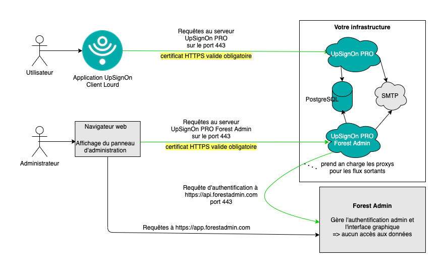
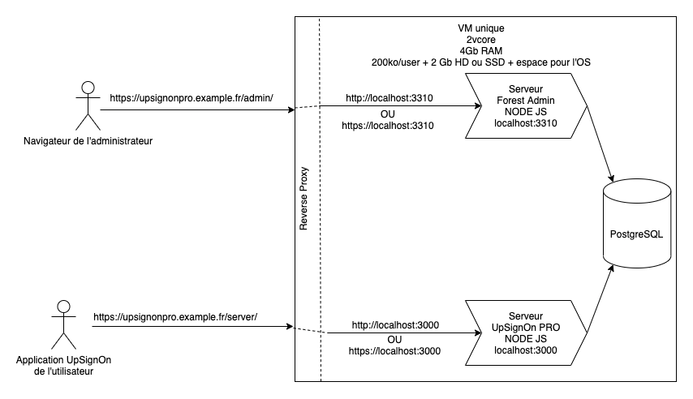
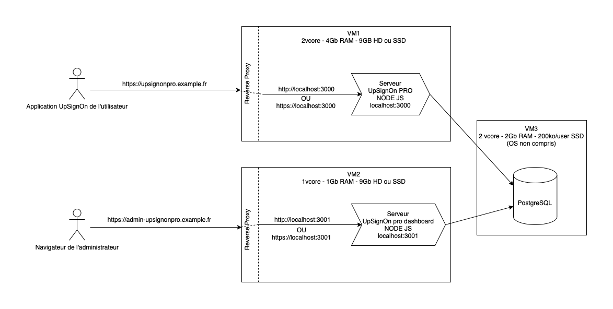

# IMPORTANT avant de commencer

- Choisissez un sous-domaine pour la configuration DNS (typiquement upsignonpro)

  - l'url sur laquelle votre serveur UpSignOn pro sera accessible sera https://upsignonpro.votre-domaine.fr)
    > NB: il est fortement recommandé que cette URL soit accesible depuis n'importe où afin que vos utilisateurs puissent accéder à leurs données tout le temps. Si vous challengez cela, nous vous recommandons d'en discuter avec nous ou de nous écrire à contact@upsignon.eu. Utiliser une URL privée nuit à la valeur ajoutée d'UpSignOn.
  - l'url sur laquelle votre serveur d'administration forest-admin sera accessible sera https://upsignonpro.votre-domaine.fr/admin)
    > NB: cette URL n'a pas besoin d'être accessible depuis l'extérieur de votre réseau. Vous pouvez donc utiliser une URL interne sans déclaration DNS. Cependant, nous recommandons d'installer le serveur Forest Admin sur la même machine que le serveur UpSignOn PRO pour simplifier l'installation et la maintenance.

- Assurez-vous de disposer d'un certificat SSL et de sa clé privée pour le sous-domaine que vous avez choisi

  - ceci est **obligatoire**
  - les certificats wildcard sont autorisés
  - **LES CERTIFICATS AUTOSIGNÉS NE FONCTIONNERONT PAS** sauf s'ils sont approuvés par toutes les machines de vos collaborateurs, mais ils restent déconseillés

- Envoyez un email **avant de commencer l'installation** à giregk@upsignon.eu en indiquant

  - l'URL de votre serveur UpSignOn PRO (https://upsignonpro.votre-domaine.fr, chemin y compris le cas échéant) pour qu'elle soit ajoutée dans notre base de données d'URLs autorisées
  - l'adresse email d'une personne qui sera administrateur du projet Forest Admin (le panneau d'administration)
    A réception de ce mail, nous vous préparerons un projet forest-admin pour que vous n'ayiez pas à le faire.
    - comme expliqué dans la documentation d'installation du serveur Forest Admin, vous recevrez une invitation par email pour créer un compte sur Forest Admin et accéder au projet que nous vous aurons préparé.
  - si vous ne nous envoyez pas cet email, vous perdrez du temps lors de l'installation

- Ressources minimales estimées
  - CPU : 2vcore
  - RAM : 512Mo minimum, 2Go pour un nombre d'utilisateurs plus importants (or système d'exploitation, donc compter peut-être 4Go si windows server, plus gourmand qu'un linux)
  - HD ou SSD : compter environ 3Go pour le système d'exploitation, les packages d'installation et le code, puis 100ko par utilisateur pour la base de données (soit 100mo pour 1000 utilisateurs), puis quelques Go pour stocker les logs (selon la durée de conservation)

# Schéma d'architecture générale



Voici deux implémentations possibles, sachant qu'il peut y avoir des variantes en fonction de vos habitudes et de vos standards.

## Déploiement type 1 (déploiement standard, recommandé)

Le plus simple.



## Déploiement type 2

- plus complexe
- séparation des processus dans des VM différentes
- permet notamment si vous le souhaitez de mettre le serveur Forest Admin dans une zone qui n'est pas accessible depuis l'extérieur de votre réseau puisque seuls vos administrateurs sont sensés être autorisés à s'y connecter de toute façon (ce qui pourrait aussi être fait dans le schéma 1 avec des proxys)



# Installation de la base de données

Vous pouvez installer la base de données postgreSQL selon vos propres procédures si vous maîtrisez bien le sujet.

1. installation de postgresql

- suivez le tutoriel correspondant à votre système sur https://www.postgresql.org/download/ (toutes les versions de postgresql devraient fonctionner)
- sur linux, saisissez `sudo -i -u postgres` pour vous connecter en tant qu'utilisateur postgres
  - la commande `psql` devrait alors fonctioner et vous faire entrer dans l'interface en ligne de commande de postgresql

2. création de la base de données pour UpSignOn PRO

Voici une procédure éprouvée pour les environnements Linux (testé sur Debian 10).
Cette procédure configure un utilisateur linux qui sera le propriétaire de la base de données et du serveur.

- Vous voudrez sans doute créer un utilisateur linux pour exécuter le serveur UpSignOn PRO dans un environnement à privilèges limités.
  Pour créer un utilisateur appelé 'upsignonpro', utilisez la commande : `sudo adduser upsignonpro`

- pour créer la base de données et pour qu'elle soit accessible par l'utilisateur linux que nous venons de créer:
  - connection en tant qu'utilisateur postgres: `su - postgres`
  - créons un rôle PostgreSQL appelé 'upsignonpro': `createuser upsignonpro`
  - créons la base de données `createdb upsignonpro -O upsignonpro` (NB: cette base de données sera provisionnée dans l'étape suivante)
  - ajoutons un mot de passe au rôle 'upsignonpro': `psql` puis dans l'invite PostgreSQL, `\password upsignonpro`
- à partir de là, vous devriez pouvoir vous connecter à votre base de données en tant qu'utilisateur 'upsignonpro' (`su - upsignonpro`) en tapant la commande `psql upsignonpro`

Dans la suite, les variables d'environnement suivantes feront référence à la configuration de la base de données

- DB_USER: nom de l'utilisateur propriétaire de la base de données (ici 'upsignonpro')
- DB_PASS: mot de passe d'accès à la base de données (celui du role 'upsignonpro')
- DB_NAME: nom de la base de données (ici 'upsignonpro')
- DB_HOST: nom d'hôte du serveur sur lequel est servi la base de données ('localhost')
- DB_PORT: port sur lequel est servi la base de données ('5432')

# Installation du serveur UpSignOn PRO

- en tant que root, installer Node.js (https://nodejs.org/en/download/package-manager/) (testé en v12 et v15)
- installer git (https://git-scm.com/book/en/v2/Getting-Started-Installing-Git)

  - NB, il n'est pas nécessaire de définir un utilisateur github

Ce qui suit doit être exécuté en tant qu'utilisateur "upsignonpro" (`su - upsignonpro` ou celui que vous avez choisi) pour que le serveur UpSignOn Pro soit exécuté dans un environnement à privilèges limités.

- ce serveur va envoyer des emails à vos utilisateurs. Vous devez donc définir une adresse email d'envoi pour ces emails. La configuration de cette adresse email sera stockée dans les variables d'environnement suivantes

  - EMAIL_HOST: nom du serveur smtp permettant d'envoyer des mails de validation aux utilisateurs
  - EMAIL_PORT: '587' a priori (dépend de votre configuration)
  - EMAIL_USER: adresse email à partir de laquelle seront envoyés les mails de validation
  - EMAIL_PASS: mot de passe pour cette adresse email

- installer yarn `npm install --global yarn`

- installer le gestionnaire de processus pm2 (redémarrage automatique du serveur, gestion de plusieurs instances, gestion des logs), `npm install pm2 -g`.

  - NB: la capacité de redémarrage automatique en cas de crash est incluse par défaut avec pm2, vous n'avez rien de plus à configurer.

- (OPTIONNEL) vous pouvez installer un certificat SSL pour que le serveur utilise HTTPS pour les connexions locales. Cette option est proposée uniquement pour les cas où vous souhaiteriez exposer directement le processus nodeJS en https. Dans le cas de l'utilisation d'un reverse proxy, la sécurité sera portée directement par le reverse proxy. Les chemins d'accès à ce certificat seront stockés dans les variables d'environnement suivantes:

  - SSL_CERTIFICATE_KEY_PATH: chemin absolu vers le fichier .key (ou .pem) utilisé pour la communication SSL locale
  - SSL_CERTIFICATE_CRT_PATH: chemin absolu vers le fichier .crt (ou .pem) utilisé pour la communication SSL locale

  - NB : l'utilisateur linux propriétaire du serveur doit pouvoir accéder à ces fichiers en lecture. N'oubliez pas de configurer les droits d'accès à ces fichiers correctement.
  - si ces deux variables d'environnement ne sont pas définies, le serveur local fonctionnera en http.

- clone du repo `git clone --branch production https://github.com/UpSignOn/UpSignOn-pro-server.git <DESTINATION_DIRECTORY>`
- dans le dossier <DESTINATION_DIRECTORY>

  - installez les nodes modules `yarn install`
  - compilez le projet `yarn build`
  - créez le fichier `.env` : `cp dot-env-example .env` (attention, le nom de ce fichier doit être exactement `.env`)
  - dans le fichier `.env`, définissez toutes vos variables d'environnement.
    - DB_USER
    - DB_PASS
    - DB_NAME
    - DB_HOST
    - DB_PORT
    - NODE_ENV: doit être 'production'
    - SERVER_PORT: port utilisé pour le serveur local
    - SSL_CERTIFICATE_KEY_PATH (optionnel)
    - SSL_CERTIFICATE_CRT_PATH (optionnel)
    - EMAIL_HOST
    - EMAIL_PORT
    - EMAIL_USER
    - EMAIL_PASS
    - API_PUBLIC_HOSTNAME: l'URL entière (chemin compris) de ce serveur UpSignOn PRO, sans 'https://'.
    - DISPLAY_NAME_IN_APP: le nom qui sera affiché aux utilisateurs dans l'application. Typiquement, le nom de votre organisation.

# Provisionning de la base de données

- `node ./scripts/migrateUp.js`

  - vous pouvez vérifier que tout s'est bien passé en vous connectant à votre base de données (`psql upsignonpro`) puis en tapant `\d` pour afficher toutes les tables. Le résultat ne doit pas être vide.
  - en cas d'erreur de connexion, vous pouvez tester via la commande
    ```
    psql -h localhost -U upsignonpro -p 5432 upsignonpro
    ```

# Démarrage du serveur

- `yarn start`
  - NB: à des fins de tests, vous pouvez également utiliser `node ./compiled/server.js`

# Configuration du redémarrage automatique du serveur

Ceci nécessite la version 5.1.1 de pm2 minimum.
Pour mettre à jour pm2, procédez ainsi :

- npm install pm2 -g
- pm2 update

Pour configurer le redémarrage automatique des processus pm2, procédez ainsi :

- `pm2 save` (pour sauvegarder la liste des processus)
- `pm2 startup -u upsignonpro` (le paramètre -u contient le nom de l'utilisateur système responsable des processus, ici upsignonpro)
- lancez la commande suggérée en tant que root.

C'est tout.
Si vous mettez à jour NodeJS ultérieurement, vous devrez relancer ces commandes pour que pm2 utilise la nouvelle version de NodeJS.

# Configuration d'un reverse proxy

Voici par exemple une configuration possible avec Nginx

- Pour installer Nginx : `apt install nginx`
- Vous aurez besoin d'un certificat et d'une clé privée pour votre sous-domaine

Dans /etc/nginx/sites-enabled/upsignon

**Fichier de configuration NGINX**

Pensez à bien modifier les valeurs sous les `# TODO`

- `cd /etc/nginx/sites-enabled`
- `nano upsignonpro`

```
proxy_set_header X-Real-IP $remote_addr;
proxy_set_header X-Forwarded-For $proxy_add_x_forwarded_for;
server_tokens off;

add_header X-Frame-Options "DENY";
add_header X-XSS-Protection "1; mode=block";
add_header X-DNS-Prefetch-Control "off";
add_header X-Download-Options "noopen";
add_header X-Content-Type-Options "nosniff";
add_header X-Permitted-Cross-Domain-Policies "none";

# TODO
ssl_certificate /etc/certificate/myDomainCertificateSignedByTrustedAuthority.cer;
# TODO
ssl_certificate_key /etc/certificate/myDomainCertificatePrivateKey.key;

ssl_ciphers "EECDH+ECDSA+AESGCM EECDH+aRSA+AESGCM EECDH+ECDSA+SHA384 EECDH+ECDSA+SHA256 EECDH+aRSA+SHA384 EECDH+aRSA+SHA256 EECDH+aRSA+RC4 EECDH EDH+aRSA HIGH !RC4 !aNULL !eNULL !LOW !3DES !MD5 !EXP !PSK !SRP !DSS";

server {
  listen 80;
  listen [::]:80;
  return 301 https://$host$request_uri;
}
server {
  listen 443 ssl http2;
  listen [::]:443 ssl http2;
  # TODO
  server_name upsignonpro.votre-domaine.fr;
  proxy_ssl_verify off;

  location / {
    proxy_pass http://localhost:3000/;
  }
}
```

> attention le '/' final dans 'http://localhost:3000/' est important.

**Après avoir configuré Nginx**

Redémarrer Nginx

```
systemctl restart nginx
```

En ouvrant la page https://upsignonpro.votre-domaine.fr/server dans votre navigateur, vous devriez voir une page de succès.

Vous pouvez également tester que l'envoi des mails fonctionne bien en ouvrant la page https://upsignonpro.votre-domaine.fr/test-email?email=votre-email@votre-domaine.fr

# Installation d'un serveur d'administration Forest-Admin

Ceci installera un deuxième serveur, indépendant du serveur UpSignOn PRO, qui vous donnera accès à une interface d'administration ergonomique de la base de données. Ce serveur ne sera utilisé que par vos administrateurs IT.

- Suivez la documentation d'installation ici : https://github.com/UpSignOn/UpSignOn-pro-forest-admin

# Dernières configurations

- Depuis votre interface d'administration Forest Admin, ajoutez les adresses email autorisées à créer un environnement PRO.
  - NB : déclarer '\*@mon-domaine.fr' aura pour effet d'autoriser toutes les adresses de ce domaine
- Depuis votre interface d'administration Forest Admin, vous pouvez ajouter les urls les plus classiques que saisiront vos agents (cette liste n'empêche pas l'enregistrement de mot de passe pour d'autres url, elle sera simplement affichée comme une liste de suggestions). Nous vous conseillons d'en mettre autant que possible pour faciliter l'onboarding des agents.
- Par défaut, toute demande de réinitialisation de mot de passe doit être acceptée manuellement par un administrateur. (Ceci permet d'éviter que quelqu'un ayant réussi à voler un téléphone pro puisse en toute autonomie réinitialiser le mot de passe UpSignOn de l'utilisateur).
  - pour autoriser un utilisateur à réinitialiser son mot de passe, rendez-vous sur Forest-Admin, table "Password Reset Requests", sélectionnez la demande correspondant à l'utilisateur en question, puis utilisez le bouton Action en haut à droite. Ceci enverra un email à l'utilisateur pour qu'il puisse réinitialiser son mot de passe.
  - vous pouvez si vous le souhaitez désactiver la vérification manuelle et laisser le système valider automatiquement toute demande de réinitialisation de mot de passe en mettant le paramètre DISABLE_MANUAL_VALIDATION_FOR_PASSWORD_FORGOTTEN à true dans la table "Settings"

# Lancement auprès des utilisateurs

Pour configurer leur espace PRO, vos utilisateurs vont devoir ouvrir un lien (ou le scanner sous forme de QR code).
Ce lien peut être simplement généré en utilisant notre outil : https://upsignon.github.io/pro-setup-link-generator/

NB: les paramètres de configuration d'OpenId Connect sont optionnels. S'ils sont présents, l'application exigera une pré-authentification sur le service OpenId Connect désigné avant de pouvoir accéder à leur espace PRO. (Contactez-nous pour plus de détails).

<details>
<summary>Trouver votre lien OpenId Connect correspondant à votre installation ADFS, Azure AD ou Azure B2C:</summary>

From the Microsoft documentation: (more details [here](https://docs.microsoft.com/en-us/azure/active-directory/develop/msal-client-application-configuration))

- AAD authorities are of the form https://login.microsoftonline.com/\{Enter_the_Tenant_Info_Here\}.
  - If your application supports Accounts in one organizational directory, replace "Enter_the_Tenant_Info_Here" value with the Tenant Id or Tenant name (for example, contoso.microsoft.com).
  - If your application supports Accounts in any organizational directory, replace "Enter_the_Tenant_Info_Here" value with organizations.
  - If your application supports Accounts in any organizational directory and personal Microsoft accounts, replace "Enter_the_Tenant_Info_Here" value with common.
  - To restrict support to Personal Microsoft accounts only, replace "Enter_the_Tenant_Info_Here" value with consumers.
- Azure B2C authorities are of the form https://\{instance\}/\{tenant\}/\{policy\}. Each policy is considered its own authority. You will have to set the all of the knownAuthorities at the time of the client application construction.
- ADFS authorities are of the form https://\{instance\}/adfs.

</details>

# Mise à jour du serveur

- `git pull`
- `yarn` (pour mettre à jour les dépendances si besoin)
- `yarn build`
- mise à jour de la base de données : `node ./scripts/migrateUp.js`
- redémarrage du serveur `yarn restart`

# Résolution de problèmes

## L'application affiche une erreur à l'ouverture du lien de configuration

Si à l'ouverture du lien de configuration, vous obtenez une erreur

```
Le serveur https://... ne peut pas être contacté. Assurez-vous d'avoir une connexion internet.
```

vous avez probablement l'un des problèmes suivants

- votre serveur n'est accessible que depuis un réseau local et vous n'y êtes pas connecté
  - assurez-vous d'être connecté à votre VPN
- votre certificat est autosigné ou la chaine de certification est cassée
  - vous pouvez le vérifier simplement en ouvrant l'url de votre serveur dans un navigateur
  - les certificats autosignés ne fonctionneront qu'à condition d'être approuvés par votre système d'exploitation
  - votre fichier .crt doit contenir les uns à la suite des autres la chaine de certificats jusqu'à un certificat signé par une autorité de certification (qui lui n'a pas besoin d'être inclus). Utilisez l'outil https://whatsmychaincert.com/ pour vérifier la validité de votre certificat.
- votre parefeu interdit la connexion par défaut et doit être explicitement configuré pour l'autoriser

Si tout ce qui précède semble bon, essayez d'ajouter un espace personnel vide. Si vous êtes capables de le créer sans générer de toaster d'erreur, la connexion internet n'est pas en cause et le problème est spécifique à votre serveur.

## L'envoi des mails ne fonctionne pas

- vérifiez que le port que vous avez défini dans votre fichier .env est bien ouvert sur le serveur smtp ciblé
  `nmap -p 587 upsignon.eu`
- vérifiez que le compte que vous avez défini dans votre fichier .env pour envoyer vos emails n'est pas configuré pour exiger des authentifications multi-facteurs.
